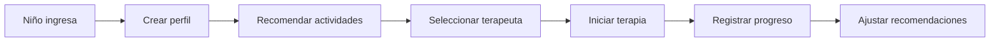

# 🚀 Guía Rápida: Sistema de Recomendaciones

## ⚡ Instalación Rápida (5 minutos)

### 1. Instalar dependencias
```bash
cd backend
pip install google-generativeai numpy
```

### 2. Configurar Gemini API
```bash
# Agregar en .env
echo "GEMINI_API_KEY=tu_api_key_aqui" >> .env
```

🔑 **Obtener API Key:** https://makersuite.google.com/app/apikey

### 3. Ejecutar instalación
```bash
python scripts/init_sistema_recomendaciones.py
```

✅ ¡Listo! El sistema está instalado.

---

## 🎯 Casos de Uso Principales

### 📌 Caso 1: "Necesito actividades para un niño"

**API Call:**
```http
GET /api/v1/recomendaciones/actividades/1?top_n=5&incluir_explicacion=true
```

**Respuesta:**
```json
{
  "recomendaciones": [
    {
      "nombre": "Juegos de turn-taking",
      "score": 0.95,
      "explicacion": "..."
    }
  ],
  "explicacion": "Basado en el perfil, estas actividades..."
}
```

---

### 📌 Caso 2: "¿Qué terapeuta asigno?"

**API Call:**
```http
POST /api/v1/recomendaciones/terapeuta/1
Content-Type: application/json

{
  "terapia_tipo": "lenguaje"
}
```

**Respuesta:**
```json
{
  "terapeuta_seleccionado": {
    "nombre": "Dra. María López",
    "score": 0.98,
    "experiencia_anos": 8
  },
  "explicacion": "Es la mejor opción porque..."
}
```

---

### 📌 Caso 3: "Necesito plan completo"

**API Call:**
```http
POST /api/v1/recomendaciones/completa/1
Content-Type: application/json

{
  "terapia_tipo": "conductual"
}
```

**Responde:**
- ✅ Actividades recomendadas
- ✅ Terapeuta óptimo seleccionado
- ✅ Explicaciones completas

---

## 🔄 Flujo de Trabajo Típico



**Paso a paso:**

1. **Crear perfil del niño** (automático al recomendar)
2. **Recomendar actividades** con explicación
3. **Seleccionar terapeuta** con TOPSIS
4. **Registrar progreso** después de cada sesión
5. **Generar nuevas recomendaciones** basadas en progreso

---

## 📊 Ejemplo Real: Niño Marco

### Perfil
- **Edad:** 6 años
- **Diagnóstico:** TEA, retraso en lenguaje expresivo
- **Dificultades:** Sensibilidad auditiva, hiperfoco visual
- **Fortalezas:** Memoria visual, reconocimiento de patrones

### Recomendación Generada

**Actividades sugeridas:**
1. ✅ Juegos de turn-taking con imágenes (score: 0.95)
2. ✅ Tarjetas PECS Nivel 2 (score: 0.92)
3. ✅ Ejercicios de imitación bucofacial (score: 0.89)
4. ✅ Actividad sensorial suave (score: 0.87)

**Terapeuta seleccionado:**
- **Nombre:** Dra. María López
- **Score TOPSIS:** 0.98
- **Experiencia:** 8 años en lenguaje
- **Carga:** 12 pacientes (óptima)

**Explicación de Gemini:**
> "Basado en el perfil de Marco, estas actividades priorizan el aprendizaje visual 
> mientras minimizan la estimulación auditiva. La Dra. López tiene experiencia 
> demostrable con niños que presentan características similares."

---

## 🛠️ Comandos Útiles

### Vectorizar nuevas actividades
```bash
python scripts/init_sistema_recomendaciones.py
```

### Ver estadísticas
```sql
-- Actividades más efectivas
SELECT 
    a.nombre,
    AVG(hp.calificacion) as efectividad
FROM historial_progreso hp
JOIN actividades a ON hp.actividad_id = a.id
GROUP BY a.id
ORDER BY efectividad DESC;
```

### Regenerar perfil de niño
```http
POST /api/v1/recomendaciones/perfil/generar
Content-Type: application/json

{
  "nino_id": 1,
  "forzar_actualizacion": true
}
```

---

## 🎨 Personalización

### Cambiar pesos de TOPSIS

```json
{
  "criterios_pesos": {
    "experiencia": 0.40,        // ⬆️ Más peso
    "disponibilidad": 0.15,
    "carga_trabajo": 0.25,
    "evaluacion_desempeno": 0.10,
    "especializacion": 0.10
  }
}
```

### Más/menos actividades

```http
GET /api/v1/recomendaciones/actividades/1?top_n=10
```

---

## ⚠️ Solución de Problemas

| Problema | Solución |
|----------|----------|
| Error: API key no configurada | Agregar `GEMINI_API_KEY` en `.env` |
| No hay actividades vectorizadas | Ejecutar `init_sistema_recomendaciones.py` |
| Embeddings vacíos | Verificar conectividad y cuota de Google AI |
| Error de importación | `pip install google-generativeai numpy` |

---

## 📚 Documentación Completa

Ver: `SISTEMA_RECOMENDACIONES_COMPLETO.md`

---

## 💬 Preguntas Frecuentes

**¿Necesito entrenar un modelo?**
No. Gemini ya viene entrenado. Solo necesitas la API key.

**¿Funciona sin Gemini?**
Sí, pero no tendrás explicaciones en lenguaje natural. TOPSIS seguirá funcionando.

**¿Qué tan preciso es?**
La similitud de contenido es determinista. TOPSIS usa criterios objetivos. Gemini mejora la interpretabilidad.

**¿Puedo usar otros criterios en TOPSIS?**
Sí, puedes personalizar los criterios y pesos según tu institución.

---

## ✨ Características Principales

- ✅ **Recomendaciones personalizadas** basadas en perfil único
- ✅ **Selección objetiva** de terapeutas con TOPSIS
- ✅ **Explicaciones comprensibles** generadas por IA
- ✅ **Aprendizaje continuo** con historial de progreso
- ✅ **API REST completa** fácil de integrar

---

**¿Listo para empezar?** 🚀

```bash
# 1. Instalar
pip install google-generativeai numpy

# 2. Configurar
echo "GEMINI_API_KEY=tu_key" >> .env

# 3. Inicializar
python scripts/init_sistema_recomendaciones.py

# 4. ¡Usar!
curl http://localhost:8000/api/v1/recomendaciones/actividades/1
```
